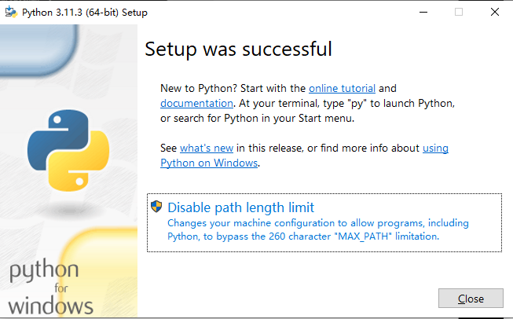

# 一、什么是Python?

Python是一门**解释性语言**，不需要编译直接运行。底层用C写的。运行速度快、跨平台、免费开源，有丰富的库。即支持面向过程也支持面向对象开发。

# 二、安装python

## 1. 安装内容

1. 安装python解释器
2. 安装pip包管理器(扩展包，在Lib/site-packages下)
3. python的标准库Lib包

pip配置源，在user目录下.pip文件，配置pip.ini

```
[global]
index-url = http://pypi.douban.com/simple
[install]
trusted-host=pypi.douban.com
```


## 2. 安装

1. 打开官网https://www.python.org/，进入downloads/windows/，安装exe文件，下载后打开





# 三、PyCharm安装

1. 打开官网下载https://www.jetbrains.com.cn/pycharm/

2. 使用software下的激活工具激活

   1. 将激活工具包中的“JetbrainsCrack-2.6.10-release-enc”文件，复制到PyCharm安装目录下的bin文件夹中

   2. 修改 bin 文件夹下的“pycharm.exe.vmoptions”和“pycharm64.exe.vmoptions”这两个文件，在文件中添加一下代码，后面地址选择第一步的地址

      `-javaagent:D:\PyCharm 2017.1.4\bin\JetbrainsCrack-2.6.10-release-enc.jar`

   3. 启动PyCharm，选择Activation code,将激活工具包的激活码复制进去