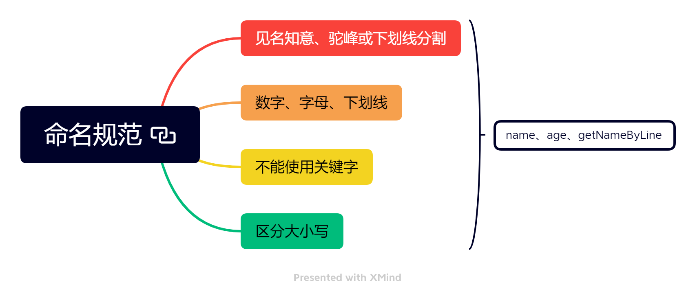
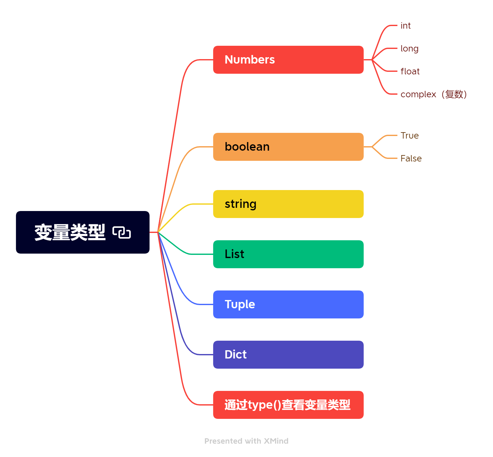

# python基础

## 1. python注释

python单行注释使用#，多行使用“”“

```python
# 单行注释
"""
多行注释
"""
```

## 2. python变量

### 1. 命名规范



### 2. 变量类型



### 3. 类型转换

- str ---> int  int('123')
- int ---> str  str(123)
- str  ---> float  float('1.1')

- int ---> float  float(12)
- float  ---> int  int(1.12)  会把小数点后的抹除
- bool  --> int  int(True)  为1  int(False) 为0

### 4. 算数运算符

```python

"""
算数运算符
+ - * / // ** %
"""
print(1+2) #3
print(5-2) #3
print(1*3) #3
print(6/2) #3.0
print(6//2) #3
print(3**1) #3
print(8%5) #3

# 打印三位数123的个十百位数
num = 123
print("%s的个位数为%s" % (num,num % 10))
print("%s的十位数为%s" % (num,num // 10 % 10))
print("%s的百位数为%s" % (num,num // 100))
'''
123的个位数为3
123的十位数为2
123的百位数为1
'''
```

### 5. 关系运算符

```python
"""
关系运算符,结果均为bool
> < >= <= == != is is not
python字符串比较大小是从第一位开始比较ASSIC码
python可以使用双判断 c<a<b
"""
a = 1
b = 2
print(a > b)
print(a < b)
print(a == b)
print(a is not b)
c = 3
print(a < b < c)
print(b < a < c)

```

### 6. 逻辑运算符

```python
"""
python逻辑运算符  and or not

"""

a = 3
b = 1
print(a and b) # 1
print(b and a) # 3,两个都为True,返回第二位

print(a or b) # 3
print(b or a) # 1,第一个为True,直接返回第一位
print(not a)
```

## 3. python格式化输出

%s替换字符串，%d替换数字,%f替换浮点数,%.2f保留2位小数

```python
print("%s和%s去吃饭,花了%.2f元" % ('zs','ls',41.2312))
#zs和ls去吃饭,花了41.23元
```

## 4. 进制转换

```python
"""
进制转换 十进制转二、八、十六进制，使用bin()、oct()、hex()方法
0b 二进制 0o八进制 0x 十六进制
"""
a = 100
print(bin(a)) # 0b1100100
print(oct(a)) # 0o144
print(hex(a)) # 0x64
print(type(hex(a)))
print(int(0b1100100))
print(type(int(0x64)))

"""
0b1100100
0o144
0x64
<class 'str'>
100
<class 'int'>
"""
```

## 5. 条件分支

```python
age = 20
if 60 > age > 18:
    print("成年人")
elif age > 60:
    print("老年人")
else:
    print("小孩") 
    
print("成年人") if age > 60 else print("小孩") 
```

## 6. 循环结构

```python
a = 10
while a > 0:
    print(a)
    a-=1
    if a == 3:
        break

b = 10
for i in range(b):
    if i > 5:
        continue
    print(i)
```

